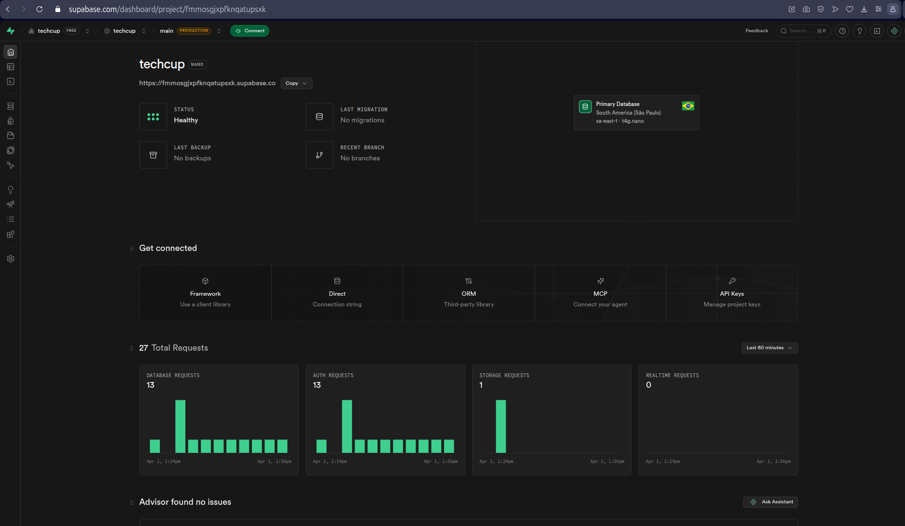
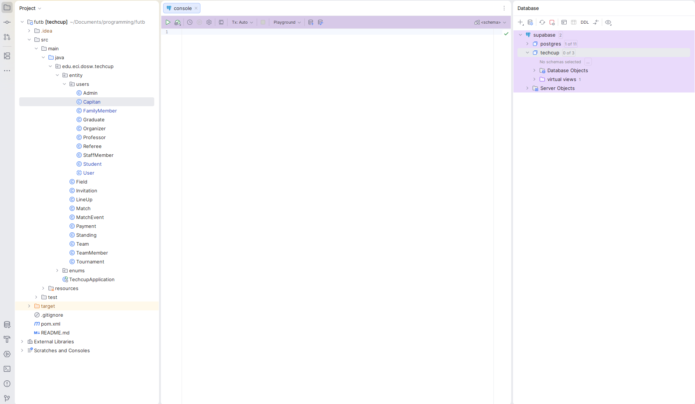

# Data base

For the project we used _Postgres_, for that matter we created an account in [supabase](https://supabase.com) so
the whole database is centralized and no one has to create it from scratch in their PCs.

---

Here we can see overview from _supabase_, as you can see there were many attemps of auth i didn't know
how to create the connection in intelli J idea

Here the connection is done.